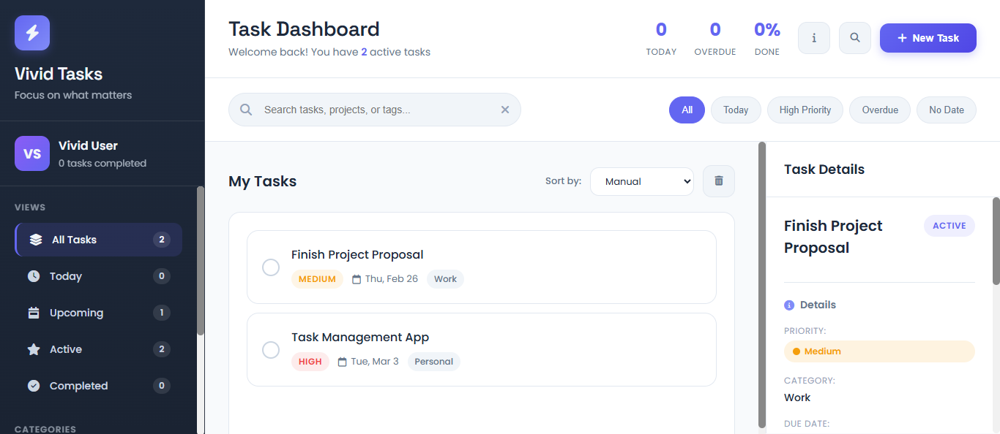

# ⚡ Vivid Tasks — Modern Task Management App


A feature-rich, responsive personal task manager built with pure HTML, CSS, and Vanilla JavaScript. No frameworks, no dependencies — just clean, modern code.

---

## 🌐 [**<span style="font-size: 24px;">Live Demo</span>**](https://vivid-tasks.netlify.app/)

---

## 📸 Preview

> [](https://vivid-tasks.netlify.app/)

---

## ✨ Features

- **📝 Task Management** — Create, edit, and delete tasks with a title, due date, priority, and category
- **⏱️ Time Tracking** — Built-in per-task timer to log time spent working
- **🎯 Smart Filters** — Filter by Today, Upcoming, Overdue, High Priority, No Date, and more
- **🗂️ Categories** — Organize tasks under Work, Personal, Health, and Learning
- **🔀 Drag & Drop** — Manually reorder tasks using native HTML5 drag and drop
- **📊 Live Stats** — Real-time dashboard showing active tasks, overdue count, and completion rate
- **🔍 Search** — Instantly search tasks by title or category
- **💾 Persistent Storage** — Tasks are saved to `localStorage` — no account or backend needed
- **📱 Fully Responsive** — Optimized for mobile, tablet, and desktop
- **⌨️ Keyboard Shortcuts** — Press `N` to create a task, `Esc` to close panels
- **🔔 Toast Notifications** — Real-time feedback for every action
- **ℹ️ Info Popup** — In-app guide explaining all features

---

## 🗂️ Project Structure

```
vivid-tasks/
│
├── index.html       # App layout and markup
├── style.css        # All styles, variables, and responsive design
└── script.js        # VividTasks class with full application logic
```

---

## 🚀 Getting Started

No build tools or installations required.

### 1. Clone the repository

```bash
git clone https://github.com/muneebali500/advanced-task-management-app.git
```

### 2. Open in browser

```bash
cd vivid-tasks
open index.html
```

Or simply double-click `index.html` — it runs entirely in the browser.

---

## 🎮 How to Use

| Action            | How                                                           |
| ----------------- | ------------------------------------------------------------- |
| Create a task     | Click **New Task** or press `N`                               |
| Set due date      | Use date picker or quick buttons (Today / Tomorrow / Weekend) |
| Set priority      | Choose Low / Medium / High in the task form                   |
| Assign category   | Select Work, Personal, or Health                              |
| Complete a task   | Click the checkbox on the left                                |
| View task details | Click the task title / body                                   |
| Edit a task       | Hover the task → click the ✏️ icon                            |
| Delete a task     | Hover the task → click the 🗑️ icon                            |
| Reorder tasks     | Drag and drop tasks in the list                               |
| Track time        | Open task details → use Start/Pause Timer                     |
| Filter tasks      | Use sidebar nav or the filter chips at the top                |
| Search tasks      | Click the 🔍 icon or type in the search bar                   |
| Close any panel   | Press `Esc`                                                   |

---

## 💻 Key JavaScript Concepts

- **Class-based Architecture** — All logic encapsulated in a single `VividTasks` class
- **localStorage** — Tasks persist across sessions without a backend
- **HTML5 Drag & Drop API** — `dragstart`, `dragover`, `drop` events for manual reordering
- **setInterval / clearInterval** — Accurate per-task time tracking with live UI updates
- **Dynamic DOM Rendering** — Tasks rendered via `innerHTML` with full event delegation
- **Array Methods** — Extensive use of `filter()`, `find()`, `findIndex()`, `map()`, `sort()`
- **ES6+ Features** — Arrow functions, template literals, destructuring, spread operator
- **Event Handling** — Keyboard shortcuts, form submissions, chip filters, and inline handlers
- **State Management** — Filter state, sort mode, edit mode, drag state all managed in class

---

## 🎨 Design Highlights

- **Dual-font system** — _Poppins_ for body, _Space Grotesk_ for headings
- **CSS Custom Properties** — Full design token system for colors, spacing, shadows, and transitions
- **Micro-interactions** — Hover lifts, active press states, and smooth slide-in animations
- **Priority color coding** — 🔴 High / 🟡 Medium / 🟢 Low across all views
- **Responsive grid** — 3-column desktop layout collapses gracefully to single-column mobile
- **Toast system** — Type-coded notifications (success / warning / danger / info) with auto-dismiss
- **Accessibility** — Visible focus states, high-contrast mode support, and `prefers-reduced-motion` respect

---

## 📦 Dependencies

All loaded via CDN — no `npm install` needed.

| Library                                                             | Purpose    |
| ------------------------------------------------------------------- | ---------- |
| [Google Fonts — Poppins & Space Grotesk](https://fonts.google.com/) | Typography |
| [Font Awesome 6.4](https://fontawesome.com/)                        | Icons      |

---

## 🛠️ Possible Improvements

- [ ] Dark mode toggle
- [ ] Subtasks / checklists per task
- [ ] Cloud sync (Firebase / Supabase)
- [ ] Export tasks to CSV or PDF
- [ ] Recurring tasks
- [ ] Notifications / reminders via browser API
- [ ] Tagging system

---

## 🙌 Acknowledgements

- [Pomodoro Technique](https://en.wikipedia.org/wiki/Pomodoro_Technique) — inspiration for the time tracking feature
- [Font Awesome](https://fontawesome.com/) — icon library
- [Google Fonts](https://fonts.google.com/) — typography

---

> Built with ❤️ using pure HTML, CSS & JavaScript — no frameworks needed.
